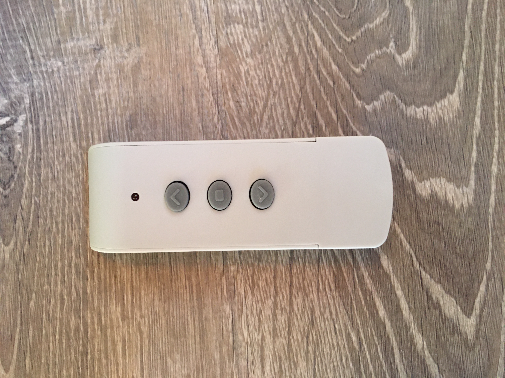
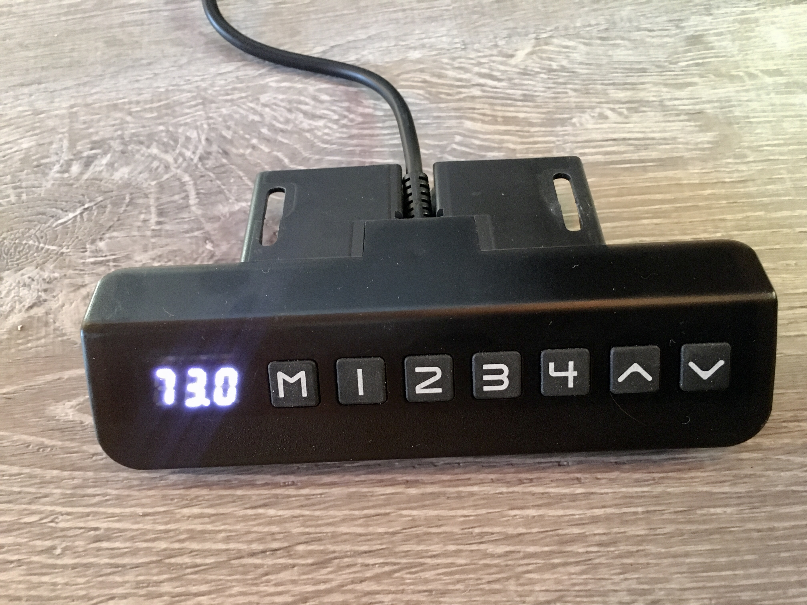
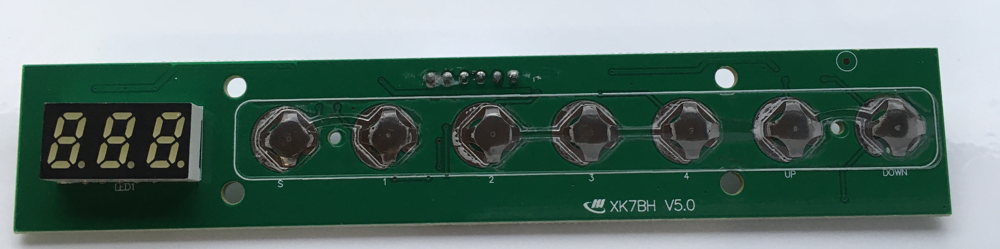

# Vevor Lift Control

I got a Vevor TV lift which is working great. But I have a tendency to turn off the TV and not lower it back down. I really want to have it automatically retract if the TV has been off for more than 10 minutes.

I asked Vevor if there were a way to integrate this with one of the home automation solutions (like Home Assistant). They responded with:

```
Hi buyer， Thank you for your time to the mail. 

Sorry, there is no way to be controlled by the automation system yet. 

The TV stand can only be controlled by the remote control. 

Hope this helps. Best wishes, 

Jennifer Customer Support
```

So..... I guess I have to figure this out on my own. The rest of this document are my notes about the journey to automating the TV lift.


* [Vevor TV lift](https://www.amazon.com/gp/product/B08B1M3L1W/ref=ppx_yo_dt_b_search_asin_title?ie=UTF8&th=1) on Amazon

## Wireless Remote

There is wireless remote that comes with the unit. After taking apart and looking inside I was able to determine it uses RF (`RLink`) to control the lift. I broke out my handy software defined radio and did a capture of the signal of `UP`. Then I replayed it through the SDR and the unit raised up. So if all else fails I can just trigger the unit with an RF signal. The signal looks like a 433 MHz AM signal.

But the wired remote has some sort of encoder readout which may make for more interesting automation.

This is what the wireless remote looks like



This is what the circuit board looks like


**Onboard key components**

* [EV1527](./docs/sunrom-206000.pdf)


## Wired Control

There is a "wired remote" that has a series of buttons to control the lift. It also has a numeric reading that indicates the lifts heigh in some way but I am not sure what the units are. For mine all the way down is `73.0` and all the way up is `173`. The "Wired Remote" connects to the lift controller with an RJ45 jack.

The numbered keys are memory positions and the arrow buttons moves the lift up and down.

The numeric display turns off after approximately 20 seconds. Press any key to turn display back on. Have to push the button again to perform the action.

This is what the wired remote looks like:




When you take the wired remote apart and look inside this is what you see (with some notes added to the image)


And this is the back of the circuit board



I tried to search for `XK7BH` but did not find anything helpful.


**Onboard key components**

- micro-controller [STC 8H1K16](https://www.stcmicro.com/datasheet/STC8F-en.pdf)
- Voltage Regulator [AMS 1117](http://www.advanced-monolithic.com/pdf/ds1117.pdf) `5.0v`->`3.3v`
* My "dumb" wuestion about decoding data stream [Electric Overflow](https://electronics.stackexchange.com/questions/599134/how-decode-serial-data-stream?noredirect=1#comment1574777_599134) I was so fixated on the physical wiring I overlooked the obvious I did not finish writing the code I needed to actually see the data. I was just printing the Len (DOH!!!)

### Encoder

**Raw Encoder Samples**

* Going Up [encoder_raise.txt](./raw_serial_captures/encoder_raise.txt)
* Going Down [encoder_lower.txt](./raw_serial_captures/encoder_lower.txt)


* `0x55 aa a6 bd 1d 00` Encoder Top (173)
* `0x55 aa a5 8c 0c 00` Encoder Bottom (73.0)


### Button Presses

* `0x55 0xFC` seems to be sent ~20 seconds after pressing a button
* `0x55 0xaa 0xf0 0xf0 0xf0` seems to be sent on button press if a button has not been pressed for a while. User needs to press button again for action to proceed.


| **Key** | **Code** | **Notes**|
|---|---|---|
| `1` | `0x55 0xaa 0xd1 0xd1 0xd1` | |
| `2` | `0x55 0xaa 0xd2 0xd2 0xd2` | |
| `3` | `0x55 0xaa 0xd3 0xd3 0xd3` | |
| `4` | `0x55 0xaa 0xd7 0xd7 0xd7` | |
| `Up` | `0x55 0xaa 0xe3 0xe3 0xe3` <br> `0x55 0xaa 0xe1 0xe1 0xe1` | Press<br>Release |
| `Down` | `0x55 0xaa 0xe2 0xe2 0xe2` <br> `0x55 0xaa 0xe3 0xe3 0xe3` | Press<br>Release |


